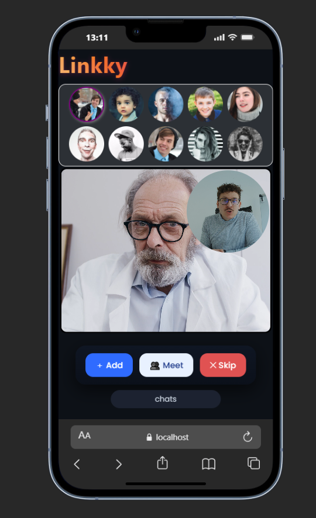
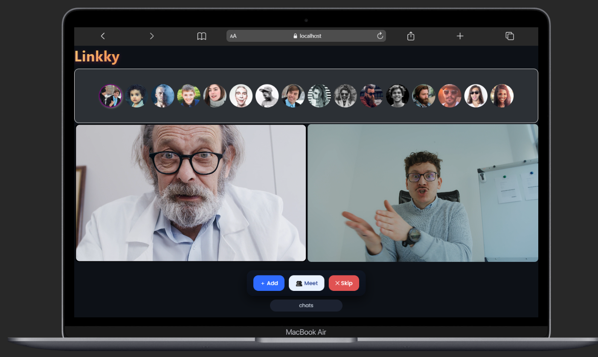
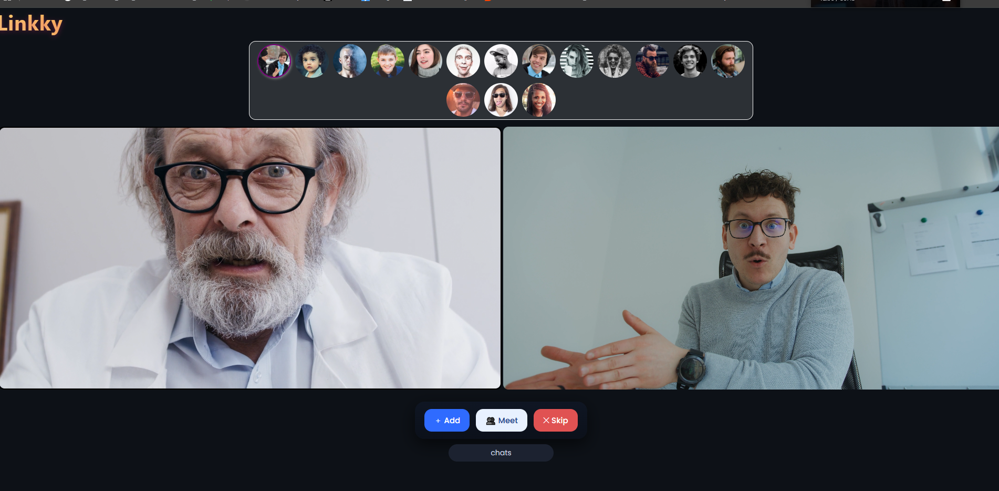

📱💻🖥️ Responsive UI Prototypes

This repository contains three UI designs, each optimized for a different screen size to ensure a smooth and responsive user experience.

📱 Mobile Design (Small Screens)

Name: Mobile UI

Designed specifically for smartphones, focusing on simplicity, touch-friendly elements, and fast usability.

💻 Laptop Design (Medium Screens)

Name: Laptop UI

Optimized for laptops and notebooks, balancing content density and comfortable navigation.

🖥️ Desktop Design (Large Screens)

Name: Desktop UI

Built for large screens and wide displays, taking advantage of extra space for a rich user interface.

// premuim user sectionn

 

 <video width="640" height="360" controls >
  <source src="./demo.mp4" type="video/mp4"/>
  
</video>

